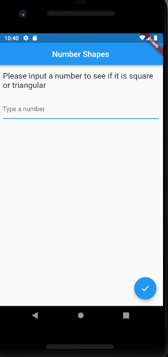
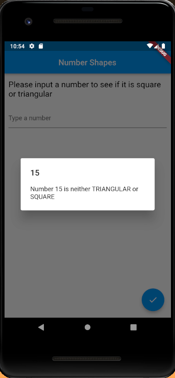
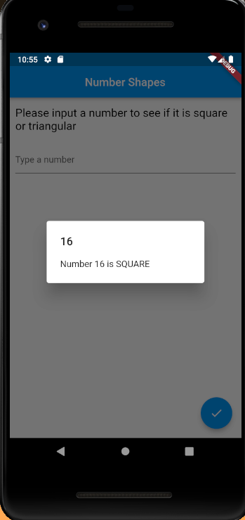
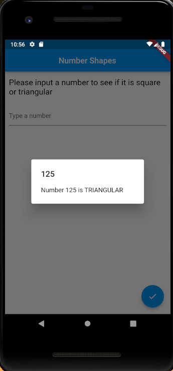
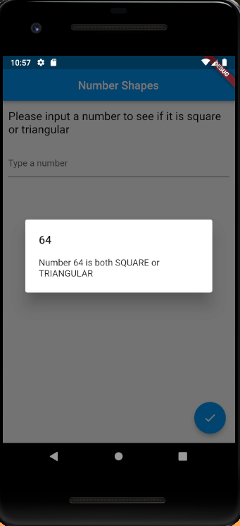

# Number Shapes

For this project, I created an App to check if a typed is neither _square_ or _triangular_, or either _square_, or either _triangular_, or _both_ .
 
Here are a few screenshots of the functionality:
  

  

  

  

  

